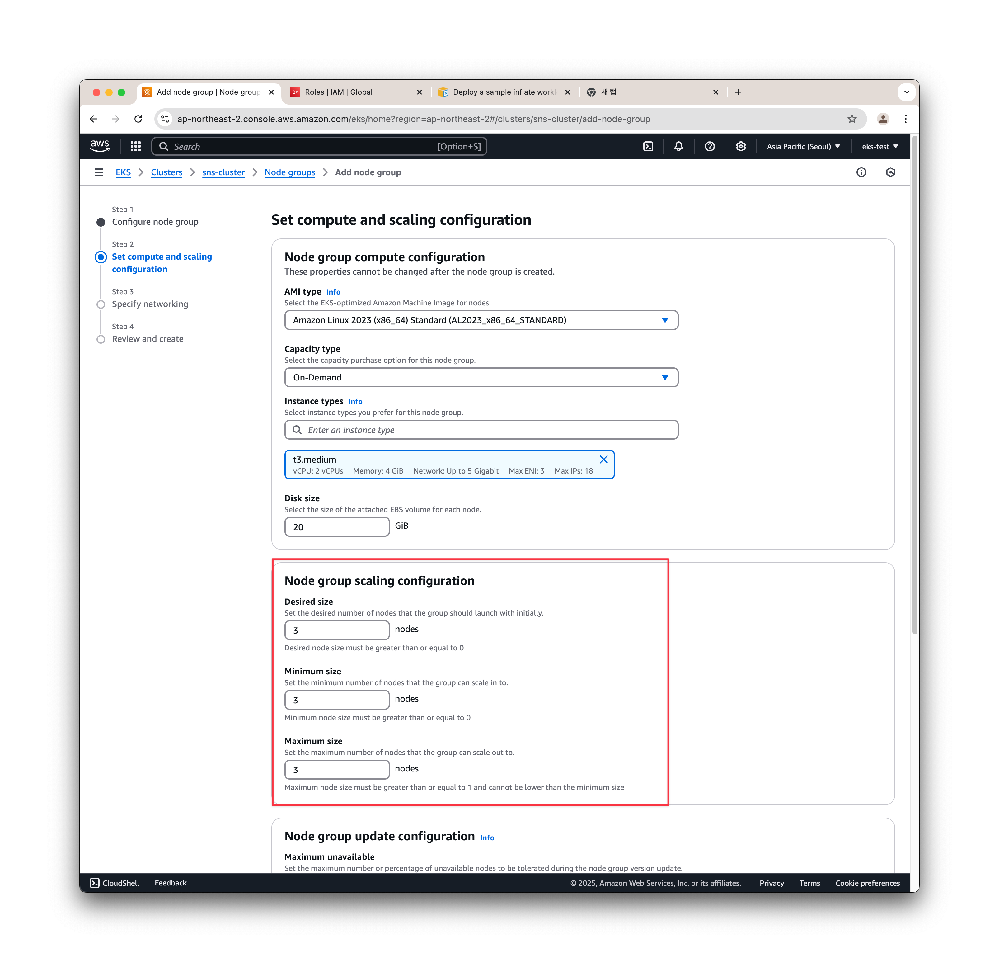
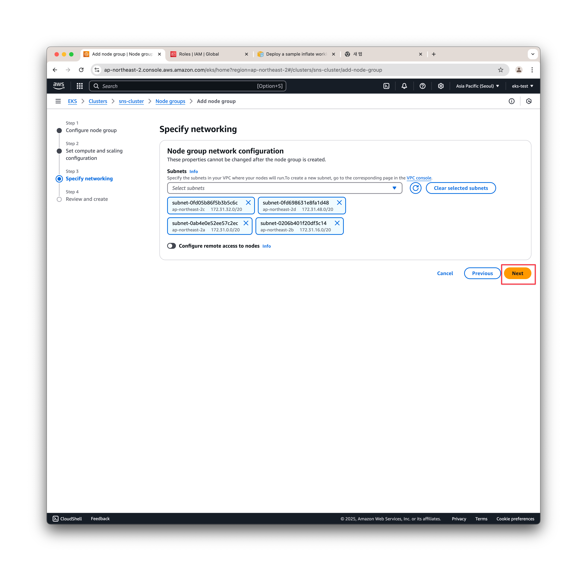

# Infra Setting

## Disclaimer
- AWS에서 EKS, EC2(Node Group), RDS를 사용하는 과정은 사용한 시간에 따라 일정한 비용을 소모하게 됩니다. 따라서 인프라를 생성하여 실습하신 뒤 해당 인프라를 그대로 방치해두면 많은 비용이 청구될 수 있으므로 가급적이면 전체 실습 과정을 한 번에 수행하시고 실습에 사용했던 인프라를 모두 제거해주시기 바라겠습니다.
- 비용 청구가 부담스러우신 분은 기존 실습에 사용하셨던 kind를 기반으로 한 로컬 환경을 그대로 사용하셔도 상관 없습니다.
  - 이 경우 저장소는 별도의 Storage Class 생성 없이 emptydir로 지정하여 사용하여 주세요. (image-server는 1개로 유지해주세요)
  - Database, Redis, Kafka는 Helm을 이용해 설치해주세요.
- Namespace
```sh
kubectl create namespace infra
```
- MySQL
```sh
helm -n infra install mysql oci://registry-1.docker.io/bitnamicharts/mysql --set primary.persistence.enabled=false --set auth.rootPassword=password!
```
- Redis
```sh
helm -n infra install redis oci://registry-1.docker.io/bitnamicharts/redis --set architecture=standalone --set auth.enabled=false --set master.persistence.enabled=false
```

- Kafka
```sh
helm -n infra install kafka oci://registry-1.docker.io/bitnamicharts/kafka --set controller.replicaCount=3  --set sasl.client.passwords=kafkakafka123! --set controller.persistence.enabled=false --set broker.persistence.enabled=false
```

- 데이터베이스가 mysql.infra.svc.cluster.local로 접근가능하도록 설치되므로 별도로 ExternalName 서비스는 만들지 않아도 괜찮습니다
- 이후 DDL 구문 실행 등 인프라 Set-up 작업을 동일하게 진행합니다

## 2025 Update : EKS Auto Mode를 사용한 설정

EKS가 2024년 12월 auto mode 업데이트와 함께 관리형 콘솔의 UI가 상당히 많이 변경되었습니다. 이에 현재 강의의 인프라 환경 셋업 과정을 auto mode를 기준으로 다시 작성하도록 하겠습니다. 기본적으로 EKS 환경 구성과 Ingress 및 로드 밸런서 셋업은 아래 문서를 참조해주시고, 이외의 코딩 관련 파트는 기존 강의의 내용에서 변경되지 않았습니다. AWS의 관리형 콘솔은 자주 업데이트 되는 편이니, 해당 문서와 강의를 참조하시면서 AWS에서 제공하는 공식 EKS 사용자 가이드([https://docs.aws.amazon.com/ko_kr/eks/latest/userguide/what-is-eks.html](https://docs.aws.amazon.com/ko_kr/eks/latest/userguide/what-is-eks.html)) 문서도 같이 참조해주시면 감사하겠습니다.

### 클러스터 생성


AWS 콘솔에 로그인합니다. 여기에서 계정은 루트 계정을 그대로 사용해도 되고 충분한 권한을 가진 서브 계정을 새로 생성해서 사용해도 좋습니다. 일반적으로 새로 만든 계정이 아니라면 기존 환경과 새로운 클러스터의 리소스들이 섞이는 것을 방지하기 위해 서브 계정을 새로 생성해서 사용하는 것이 좋은 선택입니다. 이후 진행하는 과정은 루트 계정과 서브 계정이 모두 동일합니다.


만약 처음 로그인한 계정이라면 대부분 지역이 디폴드 리전인 us-east-1 혹은 us-east-2로 설정되어 있습니다. 해당 리전에서 실습을 진행해도 과정과 결과에는 큰 차이가 없지만 일반적으로는 네트워크 지연을 줄이기 위해서 본인이 거주한 지역과 가까운 지역의 리전에서 실습을 진행하는 것이 유리합니다. 오른쪽 위의 리전을 클릭하여 리전을 변경해줄 수 있습니다. 예를 들어서 대한민국에 거주중이라면 서울에 위치한 ap-northeast-2 리전을 선택하여 콘솔의 지역을 바꿔줍니다. 다만 지역에 따라서 특정 기능이 활성화 되는 시기가 달라질 수 있으므로 이 부분은 사전에 체크해야 합니다. 이후 진행되는 과정은 서울 리전(ap-northeast-2)을 기준으로 진행되며, 이후 설명할 EKS Auto mode를 사용한 클러스터 생성은 현재 중국 리전을 제외하고 모두 사용가능합니다.

> 가끔 IAM이나 CDN과 같이 리전과 관계 없이 적용되는 서비스를 사용하다가 리전이 다른 리전으로 스위칭 되어 내가 기존에 만들었던 리소스들이 안 보이는 경우가 있습니다. 따라서 어떤 작업을 하기 전에 현재 리전을 확인해주는 것이 좋습니다.
> 


EKS에서 클러스터를 생성하기 위해서 메뉴에서 Elastic Kubernetes Service를 찾아서 선택합니다. 메뉴의 형태는 자주 바뀌기 때문에 찾기 어렵다면 콘솔 가장 위에 있는 검색창에서 EKS, 혹은 Kubernetes 등으로 검색하여 선택하시면 편합니다.


처음 들어가면 아무 클러스터도 없는 것을 확인할 수 있습니다. create cluster 버튼을 눌러서 클러스터 생성을 시작합니다.


여기에서는 새로 생긴 EKS Auto Mode를 이용해서 단순하게 클러스터를 생성할 수도 있고, 기존과 같이 직접 EKS의 세세한 설정을 조정해서 클러스터를 생성할 수도 있습니다. 다만 Custom configuration을 선택해도 EKS Auto Mode를 적용한 클러스터가 생성되기 때문에 만약 Auto Mode를 사용하지 않고자 하는 경우 설정에서 Use EKS Auto Mode를 비활성화 해야 합니다.

EKS Auto Mode는 단순히 클러스터를 자동 생성해주는 기능이 아니라 클러스터의 생성 이후 노드, 스토리지, 네트워크 등의 자원을 모두 자동으로 관리해주는 모드입니다. 다만 강의에서는 노드를 직접 관리하는 것을 기준으로 환경을 사용하기 때문에 여기에서는 Auto Mode를 이용해 클러스터를 빠르게 생성하고, 최소 설정으로 관리형 노드를 추가하여 실습을 진행하는 것을 기준으로 설명 드리겠습니다.


먼저 클러스터 이름은 랜덤으로 생성되어 있는데 사용하고자 하는 이름으로 바꿔줍니다. 여기에서는 sns-cluster라고 작성해주겠습니다. 그리고 아래 Cluster IAM role과 Node IAM role은 최초에는 선택이 안 되어 있는데, 여기에서는 우측의 Create recommended role 버튼을 눌러서 필요한 role을 만들어줍니다.


이 role 생성 화면에서는 기본적으로 필요한 role이 모두 자동 선택되어 있습니다. 따라서 별다른 변경 없이 Next 버튼을 누릅니다.


이후 계속 Next 버튼을 누른 뒤 Create role 버튼을 누르면 AmazonEKSAutoClusterRole이 생성되는 것을 확인할 수 있습니다.


이후 클러스터 생성 탭으로 돌아온 뒤 리프래시 버튼을 눌러서 방금 생성된 AmazonEKSAutoClusterRole을 Cluster IAM role에 지정해줍니다. 이후 Node IAM role 역시 Create recommended role 버튼을 눌러서 디폴트 role을 생성해줍니다.


Node IAM role 역시 클러스터 생성 탭에서 리프래시 버튼을 눌러서 생성된 role을 지정해줍니다.


이후 Create 버튼을 눌러서 클러스터를 생성합니다. 여기에서 VPC와 Subnet은 디폴트 VPC와 디폴트 Subnet을 사용했습니다. 다만 실제로 AWS에서 리소스를 생성할 때 디폴트 VPC를 사용하는 것은 크게 권장되는 설정은 아닙니다. 만약 VPC와 서브넷에 관련한 네트워크 지식이 있으신 분은 Create VPC 버튼을 눌러서, 혹은 VPC 메뉴에서 직접 VPC와 서브넷을 생성해서 사용하셔도 좋습니다. 여기에서 서브넷은 모두 퍼블릭 서브넷을 사용해서 구성하고 있으나, 실제로는 용도에 따라 프라이빗 서브넷등을 구분하여 사용해줄 수도 있습니다. 여기에서는 간단한 실습을 위해 디폴트 VPC와 서브넷을 사용하겠습니다. 따라서 기본 설정을 변경하지 않고 Create를 눌러줍니다.


클러스터 생성에는 몇 분에서 몇 십 분 정도의 시간이 필요합니다. 상태가 Creating로 표시되는 것을 확인하고 클러스터 생성이 완료될때까지 기다립니다.


클러스터 생성이 완료되면 상태가 Active로 바뀝니다. 만약 별도의 노드 생성 없이 Auto Mode로만 클러스터를 활용하고자 한다면 이 상태에서 실습을 진행해도 됩니다. 다만 이 때는 생성되는 Deployment의 Pod Template에 다음과 같이 Node Selector를 지정해주어야 합니다. 

```yaml
apiVersion: apps/v1
kind: Deployment
spec:
  replicas: 1
  template:
    spec:
      nodeSelector:
        eks.amazonaws.com/compute-type: auto
...
```

해당 설정은 강의에서는 커버되지 않는 내용이기 때문에 여기에서는 강의와 환경을 일치시키기 위해 관리형 노드 그룹을 생성해주도록 하겠습니다. 노드 그룹을 생성하기 전에 먼저 플러그인을 설치하기 위해 클러스터의 탭에서 Add-ons를 선택합니다.


Get more add-ons 버튼을 눌러서 애드온 추가 화면에 들어갑니다.


여기에서는 CoreDNS, kube-proxy, Amazon VPC CNI를 선택하여 설치해줍니다.


버전등의 설정은 자동으로 설정되기 때문에 Next를 눌러줍니다.


이후 선택한 애드온이 설치되는 것을 확인할 수 있습니다. 일반적으로 오래 걸리지는 않습니다.


이후 모든 애드온의 상태가 Active로 변하면 설치가 완료된 것입니다.


이후 노드를 생성하기 위해 클러스터 화면의 Compute 탭을 누르고 Add node group을 선택합니다.


여기에서 노드 그룹의 이름을 sns-node로 설정합니다. 그리고 Node IAM role은 기본적으로 AmazonEKSAutoNodeRole로 설정되어 있는데 이 role을 그대로 사용하면 노드 생성이 정상적으로 이루어지지 않습니다. 여기에서는 Create recommended role 버튼을 눌러서 새로운 관리형 노드용 role을 만들어주겠습니다.


여기에서는 기본적으로 EC2가 Use case로 선택되어 있습니다. 변경 없이 Next를 누릅니다.


여기에서 별다른 권한이 추가되지 않은 것처럼 보일 수 있는데 실제로는 EKS 노드에 필요한 권한이 자동으로 선택되어있는 상태입니다. 실제로 위에 보면 3/1025라는 형태로 3개의 권한이 선택되어 있음을 알 수 있습니다. 여기에서 변경 없이 Next를 누릅니다.


role 이름은 sns-node-role로 지정해줍니다. EKS 노드에 필요한 권한이 아래 추가되어 있음을 확인하고 create role을 눌러서 role을 생성하줍니다.


이후 노드 생성 탭으로 다시 돌아와서 리프래시 버튼을 눌러서 방금 생성한 sns-node-role을 지정해줍니다.


그리고 다른 설정은 변경 없이 Next 버튼을 누릅니다.



노드 스펙을 결정합니다. 여기에서 다른 스펙은 변경 없이 사용하고 노드 그룹의 수량만 지정, 최소, 최대 수량을 2개에서 3개로 변경해줍니다. 실제로 실습은 2개의 노드로도 진행할 수 있으나 일부 예외적인 상황을 위해 3개로 지정하는 것이 더 편하게 사용할 수 있습니다. 다만 노드의 수량이 늘어나면 클러스터 사용 비용도 증가하므로 2개로 지정해서 사용하다가 부족할 경우 (Pod가 계속 Pending 상태에 머무를 경우) 3개로 증가시켜줘도 좋습니다. 강의에서 설명했던 환경에 비해서 EKS Auto Mode를 사용할 경우 컨트롤러 파드들이 별도의 자동 생성된 노드에서 관리되므로 자원 사용에는 조금 더 여유가 있는 편입니다.



네트워크 설정에서는 기본적으로 선택된 서브넷을 그대로 사용할 예정이기 때문에 변경 없이 Next 버튼을 누릅니다.


이후 설정을 확인하고 Create 버튼을 눌러 노드와 노드 그룹을 생성합니다.


노드 생성 역시 다소 시간이 걸립니다. 노드의 생성은 상황에 따라 다소 다르지만 클러스터나 애드온의 생성보다는 오래걸리는 편이며 일반적으로 10분 이상 소요됩니다.


이후 인그레스 설정을 위해 서브넷에 태그를 지정해주도록 하겠습니다. 클러스터 관리 화면의 Networking 탭을 선택하고 표시된 서브넷 중 하나를 선택해서 들어갑니다.


이후 Tags 탭을 선택하고 Manage tags를 눌러줍니다.


이후 Add new tag를 눌러주고 Key에 [`kubernetes.io/role/elb`](http://kubernetes.io/role/elb) Value에 `1` 을 입력한 뒤 Save를 눌러줍니다. 이를 모든 퍼블릭 서브넷에 반복하여 지정해줍니다. 디폴트 서브넷을 사용하는 경우 4개의 서브넷이 모두 퍼블릭 서브넷이므로 모든 서브넷에 태그를 저장해주면 됩니다.


그리고 kubectl 명령을 사용하기 위한 access key 설정을 하겠습니다. 루트 계정일 경우 우측 상단의 계정명 누르고 Security credentials (보안 자격 증명) 선택해주시고, 서브 계정일 경우 메뉴에서 IAM 찾아서 들어간 뒤 Security credentials 선택해줍니다.


Access keys 섹션의 Create access key를 선택하여 새로운 엑세스 키를 생성해줍니다.


일반적으로 루트 계정의 Access key를 생성하여 사용하는 것은 권장되지 않지만, 실습 환경의 경우 해당 주의사항을 확인한 뒤 키를 생성해줄 수 있습니다. 이후 Access key와 Secret이 생성된 것을 확인할 수 있습니다. 해당 키는 이 화면에서만 확인할 수 있으므로 주의해야 합니다. 만약 이 화면을 그냥 넘겨버린 경우 해당 키를 삭제하고 새로운 키를 생성하시면 됩니다. 여기에서 Access key와 Secret을 확인해줍니다. 이 키는 타인에게 유출되지 않도록 주의하셔야 합니다.


터미널을 열고 aws cli를 이용하여 aws configure 명령을 통해 방금 생성된 Access Key와 Secret을 지정해줍니다. 만약 기존에 aws를 사용하고 계셨다면 새로운 계정으로 환경이 변경되므로 주의하셔야 합니다. aws cli가 설치되지 않은 경우 아래 가이드를 참조하여 설정해줍니다.

[https://docs.aws.amazon.com/ko_kr/eks/latest/userguide/install-awscli.html](https://docs.aws.amazon.com/ko_kr/eks/latest/userguide/install-awscli.html)

또한 실습을 위해서 kubectl 의 설치가 필요하므로, 마찬가리조 kubectl이 설치되지 않은 상태라면 아래 가이드를 참조하여 kubectl을 설치해줍니다. 만약 기존에 kubectl을 설치해서 사용하는 경우, 해당 kubectl 버전이 구버전이라면 (생성한 클러스터에 비해서 버전이 많이 차이나는 경우) 역시 재설치가 필요합니다.

[https://docs.aws.amazon.com/ko_kr/eks/latest/userguide/install-kubectl.html](https://docs.aws.amazon.com/ko_kr/eks/latest/userguide/install-kubectl.html)


이후 `aws eks update-kubeconfig —region ap-northeast-2 —name sns-cluster` 명령을 입력하여 로컬 터미널의 kubectl 명령어를 방금 생성한 클러스터와 연결해줍니다. 


kubectl version 명령을 통해 클러스터가 정상적으로 연결된 것을 확인합니다.

### EFS 설정에 대해

강의의 EFS를 이용한 스토리지 클래스 설정은 여러 가용영역에 노드가 설치된 경우 저장공간을 공유하기 위한 설정으로, 프로젝트 자체에 집중하고자 하는 경우 환경 구성이 지나치게 복잡하게 느껴지실 수 있습니다. 이 스토리지 설정의 경우 전체 과정에서 크게 중요하지 않으므로 스킵하셔도 무방합니다. 다만 EFS 스토리지 클래스 설정을 스킵했을 경우 이후 이미지 서버쪽 deployment를 설정할때 pvc 생성을 스킵하고 다음과 같이 emptyDir로 볼륨을 생성해주시면 됩니다. 이 때 이미지 서버의 replicas는 항상 1이어야 정상 동작함에 주의해주세요.

```yaml
      volumes:
        - name: image-volume
          emptyDir: {}
```

### EKS Auto Mode를 이용한 인그레스 설정

EKS Auto Mode로 클러스터를 생성한 경우 별도의 로드밸런서 설정 없이 Ingress Class를 생성하여 인그레스를 자동으로 설정할 수 있습니다. 실습과정에서 로드밸런서와 인그레스 컨트롤러 설정과 관련된 부분을 스킵하고 아래와 같이 Ingress Class를 생성해줍니다.

```yaml
apiVersion: networking.k8s.io/v1
kind: IngressClass
metadata:
  namespace: sns
  labels:
    app.kubernetes.io/name: LoadBalancerController
  name: alb 
spec:
  controller: eks.amazonaws.com/alb
```

이후 kubectl apply 명령을 통해 해당 yaml 파일을 적용하여 alb라는 이름을가진 ingress class를 생성해줍니다. 이후 실습에서 ingress를 생성하는 부분으로 넘어가시면 됩니다. 해당 실습에서도 ingress class를 alb로 지정하고 있기 때문에 ingress 설정에서 변경될 부분은 없습니다. 이에 대한 가이드는 아래 사이트를 참조해주세요.

[https://docs.aws.amazon.com/ko_kr/eks/latest/userguide/auto-elb-example.html](https://docs.aws.amazon.com/ko_kr/eks/latest/userguide/auto-elb-example.html)

> 클러스터 생성 시 퍼블릭 서브넷에 [kubernetes.io/role/elb](http://kubernetes.io/role/elb) 태그를 지정해주지 않은 경우 인그레스가 정상적으로 설정되지 않을 수 있으므로 주의해주세요.
>

> 아래 가이드는 강의 동영상에 정의된 Auto Mode를 사용하지 않는 설정에 대한 가이드입니다. 위 Auto Mode 설정으로 설정이 완료된 경우 아래 내용 중 클러스터 생성 파트는 넘어가셔도 됩니다.

## Chapter 1 : EKS Cluster 생성

### IAM Role 생성
- eks-cluster-role
  - IAM - Roles - Create Role
  - AWS Service에서 EKS - Cluster Use Case 선택
  - Add Permission에서 AmazonEKSClusterPolicy 추가되어 있는 것 확인하고 Next
  - Create Role 눌러서 생성 완료
- eks-node-role
  - IAM - Roles - Create Role
  - AWS Service에서 EC2 선택
  - Add Permission에서 다음 3가지 Permission 추가
    - AmazonEC2ContainerRegistryReadOnly
    - EKSWorkerNodePolicy
    - EKSCniPolicy
  - Create Role 눌러서 생성 완료

### Access Key 설정
- User - 현재 계정 선택
- Security Credentials - Access Key
- Create Access Key
- Use Case에서 CLI 선택
- Access Key / Secret Key 생성
- `aws configure`명령으로 Access Key , Secret Key 설정하여 CLI 설정

### EKS Cluster 생성
- Region 확인 (한국의 경우 ap-northeast-2 서울 리전 선택)
- EKS - Add Cluster - Create
- Cluster 이름 : sns-cluster
- Cluster Service Role : eks-cluster-role
- 다른 설정은 모두 기본값 사용하여 생성
  - 별도의 VPC 설정이 있는 경우 해당 VPC에 설정
- 클러스터 생성 후 Active 상태가 될때까지 기다리기

### EKS Node Group 생성
- 생성된 클러스터에서 Compute - Add node group
- Node group 이름 : sns-node
- Node IAM role : eks-node-role
- AMI type : Amazon Linux 2 (x86_64)
- Instance Type : t3.medium
- Desired, Minimum, Maximum size : 2
- 생성 후 노드 추가 완료될때까지 잠시 기다리기

### kubectl 컨텍스트 추가
- `aws eks update-kubeconfig --region ap-northeast-2 --name sns-cluster`
- `kubectl get nodes` 명령어로 실제 노드 목록 나오는지 확인

### 참고
[AWS EKS 설치 가이드](https://docs.aws.amazon.com/ko_kr/eks/latest/userguide/getting-started-console.html)

## EFS Storage 연결

## IAM Role 생성
- EKS - cluster에서 sns-cluster 선택
- OpenID Connect provider URL 복사
- IAM - Identity Providers tjsxor
- OpenID Connect 선택
- Provider URL에 EKS에서 복사한 OpenID URL 붙여넣고 Get Thumbprint 클릭
- Audience에 `sts.amazonaws.com` 입력
- Add Provider 눌러서 생성
- IAM - Roles - Create Role
- Web Identity 선택
- Identity Provider에서 OpenID URL 선택
- Audience에서 sts.amazonaws.com 선택 후 Next
- Permission에서 AmazonEFSCSIDriverPolicy 검색해서 선택 후 Next
- AmazonEKS_EFS_CSI_DriverRole으로 Role 이름 주고 생성
- IAM - Roles에서 AmazonEKS_EFS_CSI_DriverRole 선택하고 Trust Relationships 탭에서 Edit Trust Policy 서택
- Conditiond에서 `"oidc.eks.ap-northeast-2.amazonaws.com/id/OOOOOOOO:aud": "sts.amazonaws.com"`로 시작하는 한 줄 복사해서 붙여넣은 다음에 `"oidc.eks.ap-northeast-2.amazonaws.com/id/OOOOOOOO:sub": "system:serviceaccount:kube-system:efs-csi-*"`와 같은 형태로 변경
  - `aud`를 `sub`로,
  - `sts.amazonaws.com`을 `system:serviceaccount:kube-system:efs-csi-*` 으로 변경
  - 최종적으로 aud, sub 2개의 컨디션이 있어야 함
- Condition의 `StringEquals`를 `StringLike`으로 변경 후 저장

### VPC Security Group 수정
- VPC - Security Group
- 클러스터에서 사용하는 Security Group 선택
  - 별다른 설정을 하지 않았을 경우 Default Security Group
- Inbound Rules에서 Edit Inbound Rule선택
- 클러스터의 서브넷이 사용하는 대역에 대해 NFS(2049) 포트 추가 후 저장
  - 별다른 설정을 하지 않은 경우 172.31.0.0/16

### EFS Add-On 추가
- EKS - clusters - sns-cluster 선택
- Add-on 탭에서 Get more add-ons 클릭
- Amazon EFS CSI Driver 선택 후 설치
  - Role은 반드시 AmazonEKS_EFS_CSI_DriverRole 선택

### EFS FileSystem 생성
- EFS - File Systems - Create File System
  - 이름 : efs-volume
  - VPC : sns-cluster가 설치된 VPC
- 생성 후 File system ID 복사

### Storage 클래스 추가

- 다음과 같이 StorageClass 파일 생성
- fileSystemId는 EFS에서 복사한 ID로 추가

```yaml
kind: StorageClass
apiVersion: storage.k8s.io/v1
metadata:
  name: efs-sc
provisioner: efs.csi.aws.com
parameters:
  provisioningMode: efs-ap
  fileSystemId: [EFS 파일시스템 ID]
  directoryPerms: "700"
```

- `kubectl apply -f efs-sc.yaml` 명령어로 StorageClass 생성

### 참고
[EFS CSI Driver 설치 가이드](https://docs.aws.amazon.com/ko_kr/eks/latest/userguide/efs-csi.html)

## MySQL DB 설정

### RDS Database 생성
- RDS - Create database
- Easy create - MySQL
- DB Instance size : Free Tier
- DB instance identifier : sns-db
- Master username : admin
- Master password : 임의의 비밀번호
- RDS 생성 기다린 뒤, Security Group 선택
- Inbound rules - Edit inbound rules
- MYSQL/Aurora 포트에 대해서 172.31.0.0/16 혹은 eks security group 추가 후 저장

### Schema 생성

- mysql 클라이언트 파드 생성
```
kubectl run mysql-client --image=mysql:8 -it --rm -- bash
```
- mysql 클라이언트 실행
```
mysql -h [RDS Endpoint] -u admin -p
(패스워드 입력)
```
- DDL 실행
```sql
create database sns;
use sns;

create user 'sns-server'@'%' identified by 'password!';
grant all privileges on sns.* to 'sns-server'@'%';

create table social_feed
(
    feed_id         int auto_increment
        primary key,
    image_id        varchar(255)                       not null,
    uploader_id     int                                not null,
    upload_datetime datetime default CURRENT_TIMESTAMP null,
    contents        text                               null
);

create table user
(
    user_id  int auto_increment
        primary key,
    username varchar(255) not null,
    email    varchar(255) not null,
    password varchar(255) not null
);

create table follow
(
    follow_id       int auto_increment
        primary key,
    user_id         int                                not null,
    follower_id     int                                not null,
    follow_datetime datetime default CURRENT_TIMESTAMP null
);
```

## Redis, Kafka, DB Service 설치
- Namespace
```sh
kubectl create namespace infra
```

- Redis
```sh
helm -n infra install redis oci://registry-1.docker.io/bitnamicharts/redis --set architecture=standalone --set auth.enabled=false --set master.persistence.enabled=false
```

- Kafka
```sh
helm -n infra install kafka oci://registry-1.docker.io/bitnamicharts/kafka --set controller.replicaCount=3  --set sasl.client.passwords=kafkakafka123! --set controller.persistence.enabled=false --set broker.persistence.enabled=false
```

### External Name Service 설정

```yaml
apiVersion: v1
kind: Service
metadata:
  name: mysql
  namespace: infra
spec:
  type: ExternalName
  externalName: [RDS MySQL DB주소]
```

### ECR Repository 생성
- ECR - private registry - Repositories - Create Repository
- 다음과 같이 Private 저장소 생성
  - feed-server
  - user-server
  - image-server
  - notification-batch
  - timeline-server
  - sns-frontend
- 각 저장소에 대해 Create Repository 눌러서 생성 완료

## Chapter 6 : Monitoring

### metrics-server 설치

- https://github.com/kubernetes-sigs/metrics-server에서 설치 방법 확인 가능
```sh
kubectl apply -f https://github.com/kubernetes-sigs/metrics-server/releases/latest/download/components.yaml
```

### Prometheus와 Grafana 설치

- Helm Repository 추가
```sh
helm repo add prometheus-community https://prometheus-community.github.io/helm-charts
helm repo add grafana https://grafana.github.io/helm-charts
```

- Namespace 생성
```sh
kubectl create namespace monitoring
```

- Prometheus 설치
```sh
helm install prometheus prometheus-community/prometheus --namespace monitoring  --set server.persistentVolume.enabled=false --set alertmanager.persistence.enabled=false
```

- grafana.yaml 생성
```yaml
datasources:
  datasources.yaml:
    apiVersion: 1
    datasources:
    - name: Prometheus
      type: prometheus
      url: http://prometheus-server.monitoring.svc.cluster.local
      access: proxy
      isDefault: true
```
- Grafana 설치
```sh
helm install grafana grafana/grafana  --namespace monitoring --set persistence.enabled=false --set adminPassword="admin01" --values ./grafana.yaml
```

### OpenLens 설치
- https://github.com/MuhammedKalkan/OpenLens/ 에서 릴리즈 다운로드 

### KubeCost 설치
```sh
helm upgrade -i kubecost oci://public.ecr.aws/kubecost/cost-analyzer --version 1.108.1 \
    --namespace monitoring --set persistentVolume.enabled=false --set prometheus.server.persistentVolume.enabled=false \
    -f https://raw.githubusercontent.com/kubecost/cost-analyzer-helm-chart/develop/cost-analyzer/values-eks-cost-monitoring.yaml
```
- port-fowarding
```yaml
kubectl port-forward --namespace monitoring deployment/kubecost-cost-analyzer 9090
```

## Chapter 7: 성능 테스트 및 테스트 데이터 추가

### k6 설치
- https://k6.io 에서 다운로드 후 설치

### 테스트 데이터 추가
```sh
git clone https://github.com/dev-online-k8s/part3-testdatagen.git
```

```sh
SNS_DATA_GENERATOR_TELEPRESENCE_ENABLED=true java -jar TestDataGen.jar
```

### Frontend Deploy 배포

```sh
docker pull jheo/sns-frontend:1.0.0
docker tag jheo/sns-frontend:1.0.0 {ecr주소}/sns-frontend:1.0.0
docker push {ecr주소}/sns-frontend:1.0.0
```
- push에서 인증 오류 발생 시 ECR의 View push command 버튼 눌러서 로그인 방법 수행
  - aws ecr get-login-password --region ap-northeast-2 | docker login --username AWS --password-stdin {account id}.dkr.ecr.ap-northeast-2.amazonaws.com

- Deployment와 Service 생성 및 배포
```yaml
apiVersion: apps/v1
kind: Deployment
metadata:
  name: sns-frontend
  namespace: sns
spec:
  replicas: 1
  selector:
    matchLabels:
      app: sns-frontend
  template:
    metadata:
      labels:
        app: sns-frontend
    spec:
      containers:
        - name: sns-frontend-container
          image: {ecr주소}/sns-frontend:1.0.0
```

```yaml
apiVersion: v1
kind: Service
metadata:
  name: sns-frontend-service
  namespace: sns
spec:
  selector:
    app: sns-frontend
  ports:
    - protocol: TCP
      port: 3000
```

### Ingress Controller 설치
- https://docs.aws.amazon.com/ko_kr/eks/latest/userguide/alb-ingress.html
- https://docs.aws.amazon.com/ko_kr/eks/latest/userguide/aws-load-balancer-controller.html


